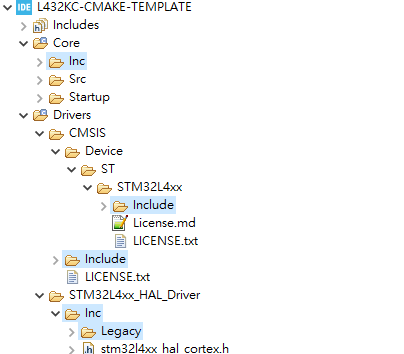
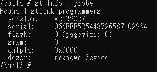

# Setting Up VS Code to Build STM32 Using CMake

Project Using STM32L432KC as Example. Test hardware is NUCLEO-L432KC.

## **Toolchain**

Download and place those in a centralized folder. Edit environment PATH for those folder or it's bin folder.

- [ARM GNU for compile](https://developer.arm.com/downloads/-/arm-gnu-toolchain-downloads)

- [CMake for easy execution of compile](https://cmake.org/download/)

- [Ninja](https://github.com/ninja-build/ninja/releases)

- ST Link from Installing STM32CubeIDE `C:\ST\STM32CubeIDE_$YOUR_VERSION_NUMBER$\STM32CubeIDE\plugins\com.st.stm32cube.ide.mcu.externaltools.stlink-gdb-server.win32_2.0.100.202109301221`

- STM32_Programmer_CLI `C:\ST\STM32CubeIDE_$YOUR_VERSION_NUMBER$\STM32CubeIDE\plugins\com.st.stm32cube.ide.mcu.externaltools.cubeprogrammer.win32_2.0.100.202110141430`


Run CMD to check toolchain installation.
```
arm-none-eabi-gcc --version
STM32_Programmer_CLI --version
ST-LINK_gdbserver --version
cmake --version
ninja --version
```

## **VS Code Extensions**

Install those extensions to allow better programming environment.
```
Arm Assembly
C/C++
CMake
CMake Tools
Cortex-Debug
LinkerScript
```

Optionally: `` Ctrl + Shift + ` `` to open terminal, then enter (Shift + Ins) those command.
```shell
code --install-extension ms-vscode.cpptools
code --install-extension ms-vscode.cmake-tools
code --install-extension twxs.cmake
code --install-extension marus25.cortex-debug
code --install-extension dan-c-underwood.arm
code --install-extension zixuanwang.linkerscript

```

## **CMake Configuration**

### About CMakeLists.txt file

Every CMake-based application requires `CMakeLists.txt` file *in the root directory*, that describes the project and provides input information for build system generation.
> Root `CMakeLists.txt` file is sometimes called *top-level CMake* file

Essential things described in `CMakeLists.txt` file:

- Toolchain information, such as GCC configuration with build flags
- Project name
- Source files to build with compiler, C, C++ or Assembly files
- List of include paths for compiler to find functions, defines, ... (`-I`)
- Linker script path
- Compilation defines, or sometimes called *preprocessor defines* (`-D`)
- Cortex-Mxx and floating point settings for instruction set generation

## Prepare .cmak file

CMake needs to be aware about Toolchain we would like to use to finally compile the project with. This file will be universal across projects.

- Make new folder in project root: `cmake`
- Make new file in /cmake: `cmake/gcc-arm-none-eabi.cmake`

```cmake
set(CMAKE_SYSTEM_NAME               Generic)
set(CMAKE_SYSTEM_PROCESSOR          arm)

# Some default GCC settings
# arm-none-eabi- must be part of path environment
set(TOOLCHAIN_PREFIX                arm-none-eabi-)
set(FLAGS                           "-fdata-sections -ffunction-sections --specs=nano.specs -Wl,--gc-sections")
set(CPP_FLAGS                       "-fno-rtti -fno-exceptions -fno-threadsafe-statics")

# Define compiler settings
set(CMAKE_C_COMPILER                ${TOOLCHAIN_PREFIX}gcc ${FLAGS})
set(CMAKE_ASM_COMPILER              ${CMAKE_C_COMPILER})
set(CMAKE_CXX_COMPILER              ${TOOLCHAIN_PREFIX}g++ ${FLAGS} ${CPP_FLAGS})
set(CMAKE_OBJCOPY                   ${TOOLCHAIN_PREFIX}objcopy)
set(CMAKE_SIZE                      ${TOOLCHAIN_PREFIX}size)

set(CMAKE_EXECUTABLE_SUFFIX_ASM     ".elf")
set(CMAKE_EXECUTABLE_SUFFIX_C       ".elf")
set(CMAKE_EXECUTABLE_SUFFIX_CXX     ".elf")

set(CMAKE_TRY_COMPILE_TARGET_TYPE STATIC_LIBRARY)
```


## Prepare CMakeLists.txt file

We need to create main `CMakeLists.txt`, also called *root* CMake file.
> Make sure you really name it `CMakeLists.txt` with correct upper and lowercase characters.

Template File as below.
```cmake
cmake_minimum_required(VERSION 3.22)

# Setup compiler settings
set(CMAKE_C_STANDARD                17)
set(CMAKE_C_STANDARD_REQUIRED       ON)
set(CMAKE_C_EXTENSIONS              ON)
set(CMAKE_CXX_STANDARD              17)
set(CMAKE_CXX_STANDARD_REQUIRED     ON)
set(CMAKE_CXX_EXTENSIONS            ON)
set(PROJ_PATH                       ${CMAKE_CURRENT_SOURCE_DIR})
message("Build type: "              ${CMAKE_BUILD_TYPE})

#
# Core project settings
#
project(your-project-name)
enable_language(C CXX ASM)

#
# Core MCU flags, CPU, instruction set and FPU setup
# Needs to be set properly for your MCU
#
set(CPU_PARAMETERS
    -mthumb

    # This needs attention to properly set for used MCU
    -mcpu=cortex-m7
    -mfpu=fpv5-d16
    -mfloat-abi=hard
)

# Set linker script
set(linker_script_SRC               ${PROJ_PATH}/path-to-linker-script.ld)
set(EXECUTABLE                      ${CMAKE_PROJECT_NAME})

#
# List of source files to compile
#
set(sources_SRCS
    # Put here your source files, one in each line, relative to CMakeLists.txt file location
)

#
# Include directories
#
set(include_path_DIRS
    # Put here your include dirs, one in each line, relative to CMakeLists.txt file location
)

#
# Symbols definition
#
set(symbols_SYMB
    # Put here your symbols (preprocessor defines), one in each line
    # Encapsulate them with double quotes for safety purpose
)

# Executable files
add_executable(${EXECUTABLE} ${sources_SRCS})

# Include paths
target_include_directories(${EXECUTABLE} PRIVATE ${include_path_DIRS})

# Project symbols
target_compile_definitions(${EXECUTABLE} PRIVATE ${symbols_SYMB})

# Compiler options
target_compile_options(${EXECUTABLE} PRIVATE
    ${CPU_PARAMETERS}
    -Wall
    -Wextra
    -Wpedantic
    -Wno-unused-parameter
    # Full debug configuration
    -Og -g3 -ggdb
)

# Linker options
target_link_options(${EXECUTABLE} PRIVATE
    -T${linker_script_SRC}
    ${CPU_PARAMETERS}
    -Wl,-Map=${CMAKE_PROJECT_NAME}.map
    --specs=nosys.specs
    -u _printf_float                # STDIO float formatting support
    -Wl,--start-group
    -lc
    -lm
    -lstdc++
    -lsupc++
    -Wl,--end-group
    -Wl,--print-memory-usage
)

# Execute post-build to print size
add_custom_command(TARGET ${EXECUTABLE} POST_BUILD
    COMMAND ${CMAKE_SIZE} $<TARGET_FILE:${EXECUTABLE}>
)

# Convert output to hex and binary
add_custom_command(TARGET ${EXECUTABLE} POST_BUILD
    COMMAND ${CMAKE_OBJCOPY} -O ihex $<TARGET_FILE:${EXECUTABLE}> ${EXECUTABLE}.hex
)

# Convert to bin file -> add conditional check?
add_custom_command(TARGET ${EXECUTABLE} POST_BUILD
    COMMAND ${CMAKE_OBJCOPY} -O binary $<TARGET_FILE:${EXECUTABLE}> ${EXECUTABLE}.bin
)
```

Be sure to edit template for the following:

1. Name your project.
`project(your-project-name)`
1. Match this to your ARM type
`
-mcpu=cortex-m7
-mfpu=fpv5-d16
-mfloat-abi=hard
`


General rule for settings would be as per table below

|STM32 Family | -mcpu           | -mfpu         | -mfloat-abi |
|-------------|-----------------|---------------|-------------|
| STM32F0     | `cortex-m0`     | `Not used`    | `soft`      |
| STM32F1     | `cortex-m3`     | `Not used`    | `soft`      |
| STM32F2     | `cortex-m3`     | `Not used`    | `soft`      |
| STM32F3     | `cortex-m4`     | `fpv4-sp-d16` | `hard`      |
| STM32F4     | `cortex-m4`     | `fpv4-sp-d16` | `hard`      |
| STM32F7 SP  | `cortex-m7`     | `fpv5-sp-d16` | `hard`      |
| STM32F7 DP  | `cortex-m7`     | `fpv5-d16`    | `hard`      |
| STM32G0     | `cortex-m0plus` | `Not used`    | `soft`      |
| STM32C0     | `cortex-m0plus` | `Not used`    | `soft`      |
| STM32G4     | `cortex-m4`     | `fpv4-sp-d16` | `hard`      |
| STM32H7     | `cortex-m7`     | `fpv5-d16`    | `hard`      |
| STM32L0     | `cortex-m0plus` | `Not used`    | `soft`      |
| STM32L1     | `cortex-m3`     | `Not used`    | `soft`      |
| STM32L4     | `cortex-m4`     | `fpv4-sp-d16` | `hard`      |
| STM32L5     | `cortex-m33`    | `fpv5-sp-d16` | `hard`      |
| STM32U5     | `cortex-m33`    | `fpv5-sp-d16` | `hard`      |
| STM32WB     | `cortex-m4`     | `fpv4-sp-d16` | `hard`      |
| STM32WL CM4 | `cortex-m4`     | `Not used`    | `soft`      |
| STM32WL CM0 | `cortex-m0plus` | `Not used`    | `soft`      |

1. Match this to your linker file name
`set(linker_script_SRC   ${PROJ_PATH}/path-to-linker-script.ld)`  


1. Include all source file (.cpp .c)
`set(sources_SRCS`  


### The best way is to run an auto scan bash script for all the source file to avoid missing anything.

In terminal `` Ctrl + ` ``, run `.\getIncludeList.sh` and `.\getSourceList.sh`

This will generate the scanned source and header file and save in cmake folder.

Template:

```bash
# Run .\getSourceList.sh in terminal to generate an updated list of source for CMake

CORE_PATH='Core/*'
DRIVERS_PATH='Drivers/*'
FATFS_PATH='FATFS/*'
MIDWARE_PATH='Middlewares/*'
USB_PATH='USB_Device/*'

CORE_SRC="$(eval find "$CORE_PATH" -type f -name '*.c' -o -name '*.cpp' -o -name '*.s')"
DRIVERS_SRC="$(eval find "$DRIVERS_PATH" -type f -name '*.c')"
FATFS_SRC="$(eval find "$FATFS_PATH" -type f -name '*.c')"
MIDWARE_SRC="$(eval find "$MIDWARE_PATH" -type f -name '*.c')"
USB_SRC="$(eval find "$USB_PATH" -type f -name '*.c')"

# Print find result
printf "$CORE_SRC\n$DRIVERS_SRC\n$FATFS_SRC\n$USB_SRC\n$MIDWARE_SRC" > cmake/SourceList.txt

# Has bug
#ALL_SRC="$(eval find * ! -wholename 'build/*' -type f -name '*.c' -o -name '*.cpp' -o -name '*.s')"
#printf "$ALL_SRC" > test.txt

# Adding ${PROJ_PATH}/ to beginning of each line
sed -i 's/^/${PROJ_PATH}\//' cmake/SourceList.txt
```

```bash
# Run .\getIncludeList.sh in terminal to generate an updated list of source for CMake

CORE_PATH='Core/*'
DRIVERS_PATH='Drivers/*'
FATFS_PATH='FATFS/*'
MIDWARE_PATH='Middlewares/*'
USB_PATH='USB_Device/*'

CORE_INC="$(eval find "$CORE_PATH" -type d -name 'Inc' -o -name 'Include')"
DRIVERS_INC="$(eval find "$DRIVERS_PATH" -type d -name 'Inc' -o -name 'Include' -o -name 'Legacy')"
FATFS_INC="$(eval find "$FATFS_PATH" -type d)"
MIDWARE_INC="$(eval find "$MIDWARE_PATH" -type d -name 'Inc' -o -name 'src')"
USB_INC="$(eval find "$USB_PATH" -type d)"

# Print find result
printf "$CORE_INC\n$DRIVERS_INC\n$FATFS_INC\n$MIDWARE_INC\n$USB_INC" > cmake/IncludeList.txt

# Adding ${PROJ_PATH}/ to beginning of each line
sed -i 's/^/${PROJ_PATH}\//' cmake/IncludeList.txt
```

1. Include all your header file path (.h)
`set(include_path_DIRS`  


1. Define ARM and HAL variable
`set(symbols_SYMB`  


## Prepare CMakePresets.json file

`CMakePresets.json` provides definition for user configuration. Having this file allows developer to quickly change between debug and release mode.

Create file `CMakePresets.json` in Project Root

```json
{
    "version": 3,
    "configurePresets": [
        {
            "name": "default",
            "hidden": true,
            "generator": "Ninja",
            "binaryDir": "${sourceDir}/build/${presetName}",
            "toolchainFile": "${sourceDir}/cmake/gcc-arm-none-eabi.cmake",
            "cacheVariables": {
                "CMAKE_EXPORT_COMPILE_COMMANDS": "ON"
            }
        },
        {
            "name": "Debug",
            "inherits": "default",
            "cacheVariables": {
                "CMAKE_BUILD_TYPE": "Debug"
            }
        },
        {
            "name": "RelWithDebInfo",
            "inherits": "default",
            "cacheVariables": {
                "CMAKE_BUILD_TYPE": "RelWithDebInfo"
            }
        },
        {
            "name": "Release",
            "inherits": "default",
            "cacheVariables": {
                "CMAKE_BUILD_TYPE": "Release"
            }
        },
        {
            "name": "MinSizeRel",
            "inherits": "default",
            "cacheVariables": {
                "CMAKE_BUILD_TYPE": "MinSizeRel"
            }
        }
    ]
}
```

## Configure VS Code to be Ready for CMake

Restart VS Code window to have CMake reading the `CMakePresets.json` file. This will auto apply correct build tool chain for build compile.

## Build Project

At bottom left. Select configuration, for example `[DEBUG]`.

Then select `Build` to compile.


## Debug project with cortex-debug

Create `.vscode/launch.json`

> Device name may be comment out. It is just a reference.

Template:

```json
{
    "version": "0.2.0",
    "configurations": [
        {
            "name": "Debug Microcontroller - STLink-V3",
            "cwd": "${workspaceFolder}",                        //Path from where commands are executed
            "type": "cortex-debug",                             //Debug 
            "executable": "${command:cmake.launchTargetPath}",  //or fixed file path: build/project-name.elf
            "request": "launch",                                //Use "attach" to connect to target w/o elf download
            "servertype": "stlink",                             //Use stlink setup of cortex-M debug
            "device": "STM32L432KC",                            //MCU used
            "interface": "swd",                                 //Interface setup
            "serialNumber": "",                                 //Set ST-Link ID if you use multiple at the same time
            "runToEntryPoint": "main",                          //Run to main and stop there
            "svdFile": "STM32L432KC.svd",                         //SVD file to see reisters
            "v1": false,
            "showDevDebugOutput": "both",

            // Will get automatically detected if STM32CubeIDE is installed to default directory or it can be manually provided if necessary..
            // "serverpath": "c:\\ST\\STM32CubeIDE_1.7.0\\STM32CubeIDE\\plugins\\com.st.stm32cube.ide.mcu.externaltools.stlink-gdb-server.win32_2.0.100.202109301221\\tools\\bin\\ST-LINK_gdbserver.exe",
            // "armToolchainPath": "c:\\ST\\STM32CubeIDE_1.7.0\\STM32CubeIDE\\plugins\\com.st.stm32cube.ide.mcu.externaltools.gnu-tools-for-stm32.9-2020-q2-update.win32_2.0.0.202105311346\\tools\\bin",
            // "stm32cubeprogrammer": "c:\\Program Files\\STMicroelectronics\\STM32Cube\\STM32CubeProgrammer\\bin",

            // If you use external loader, add additional arguments
            // "serverArgs": ["--extload", "path/to/ext/loader.stldr"],
        }
    ]
}
```
Open debug tab. And `cortex-debug` should be available to run (F5).


## Monitor Register Using SVG (System View Description) File

Download SVG file from [ST website/STM32XXXX/CAD Resources](https://www.st.com/en/microcontrollers-microprocessors/stm32l432kc.html#cad-resources)

Place SVG file within project root and specifiy path in `launch.json`.


## IntelliSense Setting

Configuring the auto complete and syntax detaction

Create file `.vscode/c_cpp_preperties.json`

Template:

```json
{
    "version": 4,
    "configurations": [
        {
            "name": "STM32",
            "intelliSenseMode": "${default}",
            "configurationProvider": "ms-vscode.cmake-tools"
        }
    ]
}
```

## Flash to Target

Configuring the VS Code Run Task `Ctrl + Shift + P > run task + Enter` feature. This will allow auto excution of running custom terminal commands.

Create file `.vscode/tasks.json`

> Setting Run Task shortcut (Ctrl + T) for VS Code is useful to excute the Flash .elf file command.

Template:

```json
{
	"version": "2.0.0",
	"tasks": [
		{
			"type": "shell",
			"label": "CubeProg: Flash project (SWD)",
			"command": "STM32_Programmer_CLI",
			"args": [
				"--connect",
				"port=swd",
				"--download",
				"${command:cmake.launchTargetPath}",
				"-rst",
				"-run"
			],
			"options": {
				"cwd": "${workspaceFolder}"
			},
			"problemMatcher": []
		}
	]
}
```

## .gitignore

Don't forget to set ignoring build files to avoid bloated git repo.

gitignore rule:
```
build/
```

Optionally, you may still keep STM32CubeMX Project for Pin Management and Code Generation

Best practice is to track only .ioc file in CubeMX folder.

The rest of code generation should be treated as `build` files that does not get tracked.

gitignore rule:
```
CubeMX/*
!CubeMX/*.ioc
```


## WSL
Follow this: https://learn.microsoft.com/en-us/windows/wsl/setup/environment?source=recommendations

Some BIOS need to enable virtualization


## Docker


### Installation
Install Docker Desktop: https://www.docker.com/products/docker-desktop/

Enable Setting: "Use the WSL 2 based engine" and "Resources/WSL Integration/integration with my default WSL distro"


### Build Your Own

Dockerfile can be found in here:

https://github.com/jasonyang-ee/STM32-Dockerfile.git


### Image Ready To Use

Ubuntu:
```
docker pull jasonyangee/stm32_ubuntu
```

Alpine:
```
docker pull jasonyang/stm32_alpine
```


### Run Container
```
docker run -it stm32_ubuntu:latest
docker run -it stm32_alpine:latest
```


### Prepare USB passthrough to WSL Docker container
Follow this:
https://learn.microsoft.com/en-us/windows/wsl/connect-usb

- Run cmd (admin mode) on Windows:

```cmd
> winget install --interactive --exact dorssel.usbipd-win
> wsl --update
> wsl --shutdown
```

- Run (restart) WSL Ubuntu:

```shell
$ sudo apt install linux-tools-5.4.0-77-generic hwdata
$ sudo update-alternatives --install /usr/local/bin/usbip usbip /usr/lib/linux-tools/5.4.0-77-generic/usbip 20
```
```shell
// Optionally
$ sudo apt update
$ sudo apt upgrade
$ sudo apt autoremove
```

- Run cmd (admin mode) on Windows:

```cmd
> usbipd list
// Note the ST-Link ID and bind it

> usbipd bind --busid 3-5
> usbipd attach --busid 3-5
> usbipd wsl list
```


### Run Docker container

- Run WSL Ubuntu:
```shell
$ docker run -it --privileged IMAGE:VERSION
$ st-info --probe
```
